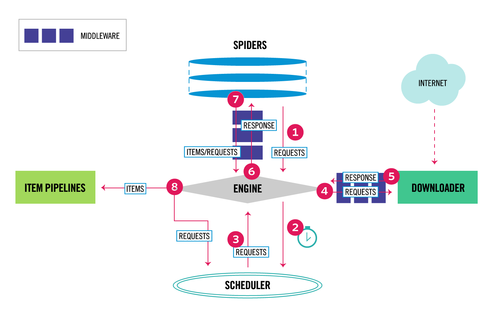

## 系统架构



Scrapy 是一个基于Python的开源网络爬虫框架，用于高效地抓取网站数据并提取结构化信息。

其异步处理能力使得Scrapy能够高效地处理并发请求，适用于大规模的数据抓取任务。

它的系统架构设计得非常灵活和模块化，使得开发者可以根据需求轻松地扩展和定制爬虫功能。

以下是Scrapy爬虫框架的系统架构介绍：

### 1. **核心组件**

#### 1.1 **引擎（Engine）**
- **职责**：负责控制整个系统的数据流，触发事件，并协调各个组件之间的交互。
- **工作流程**：引擎从调度器获取下一个要爬取的请求（Request），将其发送给下载器，下载完成后将响应（Response）发送给Spider进行处理。

#### 1.2 **调度器（Scheduler）**
- **职责**：负责存储和调度请求。它接收来自引擎的请求，并根据优先级或其他策略决定下一个要处理的请求。
- **功能**：支持去重（通过请求指纹）、优先级排序、延迟请求等功能。

#### 1.3 **下载器（Downloader）**
- **职责**：负责处理HTTP请求，从互联网上下载网页内容，并将响应返回给引擎。
- **功能**：支持HTTP/HTTPS协议、代理、Cookies、用户代理（User-Agent）等。

#### 1.4 **Spider**
- **职责**：负责解析下载器返回的响应，提取数据（Item）和新的请求（Request）。
- **功能**：开发者主要编写Spider代码，定义如何解析网页内容、提取数据、生成新的请求等。

#### 1.5 **管道（Item Pipeline）**
- **职责**：负责处理Spider提取的Item数据，进行清洗、验证、存储等操作。
- **功能**：支持多种数据存储方式，如数据库、文件、API等。

#### 1.6 **中间件（Middleware）**
- **职责**：提供扩展点，允许在请求和响应的处理过程中插入自定义逻辑。
- **分类**：
  - **下载中间件（Downloader Middleware）**：处理请求和响应的中间件，如代理、重试、用户代理等。
  - **Spider中间件（Spider Middleware）**：处理Spider的输入（响应）和输出（请求和Item）的中间件。

### 2. **数据流**

Scrapy的数据流是单向的，从引擎开始，经过调度器、下载器、Spider，最后到达管道。具体流程如下：

1. **引擎**从**调度器**获取下一个要爬取的请求。
2. **引擎**将请求发送给**下载器**，下载器执行HTTP请求并获取响应。
3. **下载器**将响应返回给**引擎**，引擎将响应发送给**Spider**进行解析。
4. **Spider**解析响应，提取数据（Item）和新的请求（Request），并将它们返回给引擎。
5. **引擎**将提取的Item发送给**管道**进行处理，将新的请求发送给**调度器**。
6. **调度器**存储新的请求，并根据优先级决定下一个要处理的请求。

### 3. **扩展与定制**

Scrapy的模块化设计使得开发者可以轻松地扩展和定制爬虫功能：

- **自定义Spider**：开发者可以编写自定义的Spider类，定义如何解析网页、提取数据、生成新的请求等。
- **自定义管道**：开发者可以编写自定义的Item Pipeline，处理提取的数据，如存储到数据库、文件等。
- **自定义中间件**：开发者可以编写自定义的下载中间件或Spider中间件，插入自定义逻辑，如代理、重试、用户代理等。

### 4. **异步处理**

Scrapy基于Twisted异步网络库，能够高效地处理并发请求，提高爬取效率。下载器和引擎之间的交互是异步的，这使得Scrapy能够同时处理多个请求，而不会阻塞。


## 安装依赖

### 全局安装

```
python -m pip install --upgrade pip
python -m pip install -r requirements.txt
```

### 局部安装

```
# 创建虚拟环境
python -m venv venv

# 启动虚拟环境(windows)
venv\Scripts\activate.bat

# 启动虚拟环境(linux and mac)
source ./venv/bin/activate

# 在虚拟环境中安装依赖
python -m pip install --upgrade pip
python -m pip install -r requirements.txt
```

## 配置

复制 `env.example` 文件为 `.env` 配置文件

- `HTTP_PROXY`: 爬虫代理，默认为空字符串。
- `DB_TYPE`: 数据库类型。仅支持 `postgresql` 和 `mysql`。


## 程序初始化

```
# 主要是初始化数据库
python main.py init
```

## 常用命令

```
scrapy crawl yourspidername

# 也可以添加自定义参数，在初始化爬虫实例时传入
scrapy crawl yourspidername -a arg1=abc -a arg2=cdf

# 新建爬虫
scrapy genspider itcast "itcast.cn"

# 运行爬虫并导出数据
scrapy crawl itcast -o itcast.xlsx

# 导出数据到Excel
python main.py export itcast

# 导出数据到Excel，并下载图片
python main.py export itcast image
```


## JS渲染服务

某些网站可能开启JS渲染，以此反爬虫。使用 `JS渲染服务`，代理网络请求，可以获取正确的返回结果。

[Splash](https://splash.readthedocs.io/en/stable/install.html) 可提供专业的`JS渲染服务`。

```
# 下载 splash 镜像
sudo docker pull scrapinghub/splash
# 启动 splash 容器。因需要使用宿主机的HTTP代理服务。故添加 --net host 参数
sudo docker run -it --net host -p 8050:8050 --rm scrapinghub/splash
```

--------------------------

> Scrapy安装指南：https://docs.scrapy.org/en/latest/intro/install.html#using-a-virtual-environment-recommended

> Scrapy命令行工具：https://docs.scrapy.org/en/latest/topics/commands.html

> Scrapy架构概述： https://docs.scrapy.org/en/latest/topics/architecture.html
